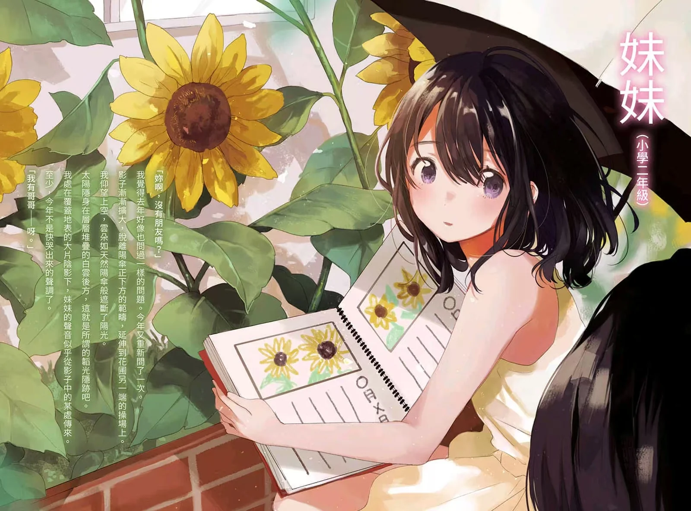

# 妹妹人生

*8/28*

看完了妹妹人生，感觉好空虚。脑子里感觉有好多感情混杂在一起像浆糊一样，哥哥为什么会在妹妹与她之间选择前者呢，又是怎样接受了妹妹比自己更“成功”这样的事实呢？感觉似懂非懂。是因为妹妹慢慢成为了我人生中的全部，因此只要妹妹能露出笑容我便无所谓了吗？是与生俱来的亲情与血缘吗，所以想永远守护妹妹做妹妹的后背，但如果妹妹有一天能够自己养活自己了，我存在的意义是什么呢？总感觉有好多心绪啊。这本书对我来说又意味着什么呢？等日子过得太平静的时候，再读一读上半卷吧。

入间老师的文笔我很喜欢，但总会有人很讨厌这种细腻的描写，有一种高中生故作高深的说出一些看似很有道理却没什么价值的文字的感觉？或许我就是处于这个年龄所以才会很喜欢吧。

看了看b站上的一些读后感，果然我的表达能力还是太欠缺了。首先呢，最吸引的地方我觉得还是在于中间妹妹20-26岁的这个时间段，我选择去面包工厂打工养活妹妹。工作物理与心境的双重劳累、对于女友和妹妹的抉择问题、如何对待父母与外人的眼光、妹妹成为小说家后我对于未来的种种迷茫、决定要不要搬离这座生活了十几年的城市，大大小小的问题在这几年全部涌入了我的生活之中，能成为慰藉的只有妹妹的笑容。这一段的生活很压抑，有种不知道结尾是be还是he的紧张的感觉，催人往下阅读。其次呢，个人来说，书中时不时出现的一些感想总能引发我的共情。比如在祖母的葬礼上关于人生终点的思考，多年后重回校园时对于时间流逝的感伤……作者很擅长用简洁的文字叙述，比如印象很深刻的22岁的结尾，从老家回来后我想明白了接下来做何选择并向妹妹告白，结尾是这么写的：四季更迭，妹妹多了一岁，春天再次到来。结束了人生重要的一个阶段转向下一个阶段，又夹杂着时光流逝的感伤。再往下说呢，很多很多兄妹互动的情节充满细节，真挚而动人。妹妹20岁的生日，回老家时夜晚的漫谈，妹妹从东京回来后要我背她回家，以及各种下班回来后的日常……看到妹妹的笑容确实是我活着的支柱，但明明是如此幸福的场景总是感觉有一丝压抑悲伤在的，也许就是因为生活中的烦恼太多，才显得兄妹间的互动更为珍贵吧。

如何描述这两个人这么多年的情感呢？想来想去似乎只有兄妹吧。

我感觉自己真的是个妹控吧。如果自己有个妹妹用着很多年的旧手机不换、在外面也没什么朋友、从来没自己出过太远门、喜欢一直黏着哥哥，我也会有一种心酸的感觉。毕竟这样的妹妹，身为哥哥的怎么可能忍着不去保护她呢？是血缘关系吗，身为哥哥的人就是会无条件地去爱自己地妹妹或者弟弟啊。

总之，我很喜欢这本书。这个“妹妹人生”。
