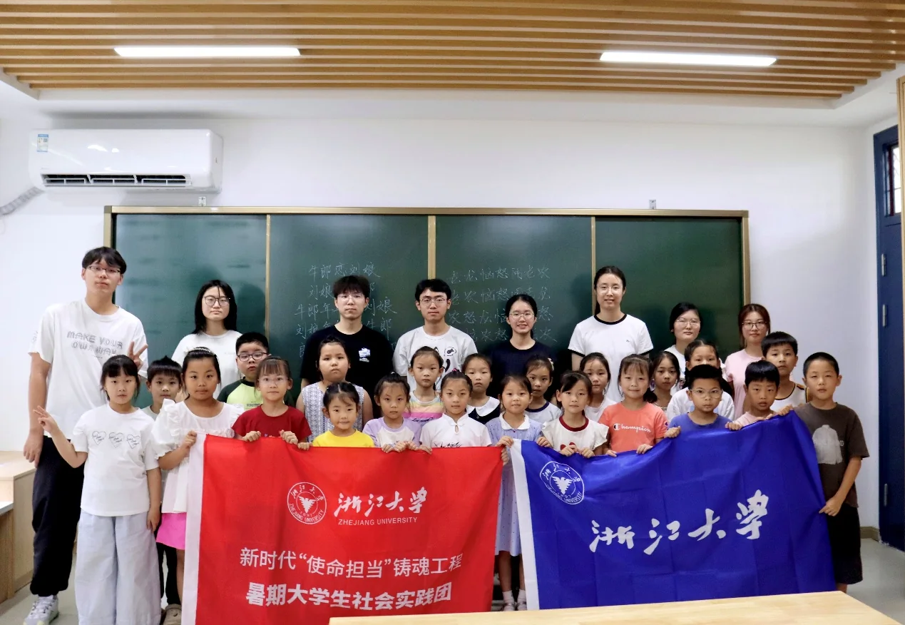
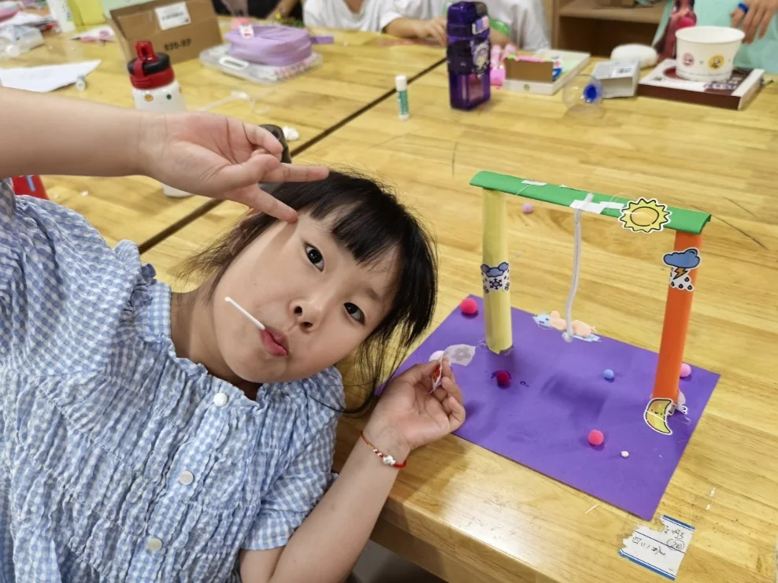
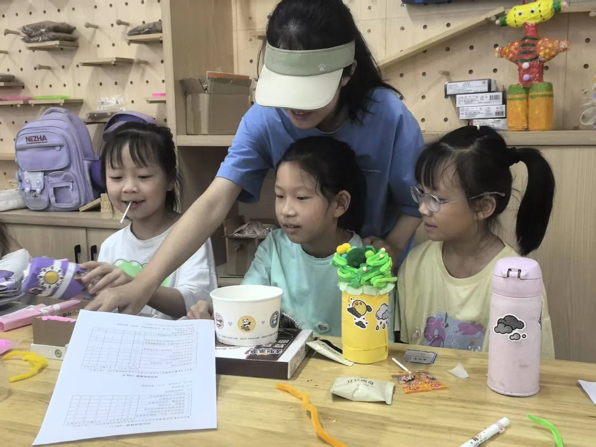
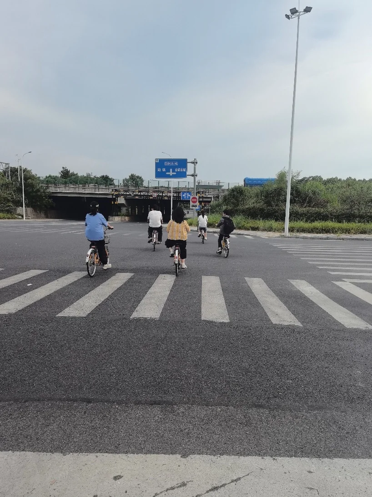
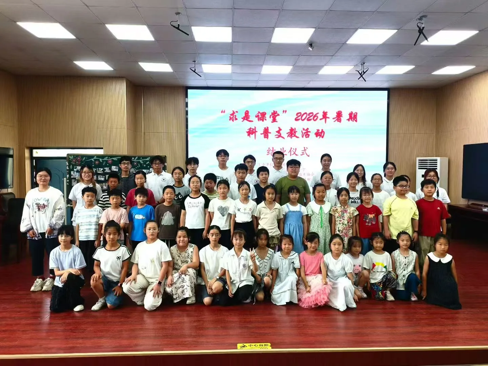

# 詹家小学支教的日子

十几天，说长不长，说短好像也不是很短。

至少在踏入詹家小学之前，我从未想过自己会记住这么多孩子的名字，也从未想过会因为一句“为什么不能再多陪我们五天”而难受很久。从最开始略带拘谨的自我介绍，到课间熟悉的一声声“老师”，陌生感就在一天天彼此的陪伴中逐渐消散。

这次支教我负责了低年级的”运动健康与伤情处理“课程，为小孩子们讲解常见的擦伤、扭伤如何处理。短短的十几页ppt，考虑到他们理解能力有限，我修改了很多遍，又增添了许多图片、小游戏与互动环节。最初站在讲台上多少有些紧张，但当我递出第一个问题后，一只只小手争先恐后地举起来时，不安的情绪很快被孩子们洋溢的热情冲散。没想到我买的饼干、棒棒糖和铅笔都很受他们欢迎，希望几颗趣多多真的能让他们记住我想传递的知识。

{ loading=lazy }

除开讲课以外，我们更多的是陪伴。上课时，我会坐在后排静静地看着其他队员讲课，偶尔会与旁边的小孩互动或是维持秩序；在课间，孩子们很喜欢玩飞行棋或者等待我们老师投喂零食，他们都有一种简单而纯粹的天真，稚嫩的笑颜和话语总能让我感受到心灵的净化。孩子们也似乎很容易感到快乐，一颗糖果、一个折纸、一幅抽象的画作、几句简单的夸奖，都足以换来他们毫不掩饰的笑容。

慢慢地，我也熟识了许多可爱的小孩。

晴月是我最早认识的，因为第一节心理团辅课的游戏时我就坐在她旁边，而我猜拳貌似一次没有赢过她。熟悉后，她总喜欢让我抱她，拿着彩纸让我帮她折小狗、小兔子，每次我带零食来的时候她也是眼睛最尖的那个。她有一盒彩笔，喜欢画画，喜欢做手工，我会教她一笔一笔地画罗小黑、玩你画我猜，陪她做树叶拼贴画、做废物利用的秋千。她也是个很活泼的小孩，有时候我们两个之间会互相开玩笑、互相推搡，明明只认识了几天，相处起来却像是熟悉了很久。还有画画很厉害的欣妍、悦欣，可爱的熙荑、雨欣，调皮捣蛋的文轩、俊轩，正如我明信片中所写的那样，他们稚嫩的声音、甜甜的笑容，能洗刷掉我所有的不开心。

{ loading=lazy }

{ loading=lazy }

临走那几天，晴月总会问我下周我们还会不会来、明年还会不会再见，我总是笑着安慰她，但每每听到这些总觉得心里一阵难受。虽然只是暑假中短短的十几天，但这些日子我们都是真真切切一起度过的，也许人与人之间产生感情并不需要很长时间，每天见面、一起上课、一起玩，一句熟悉的“老师”，一句课下的“要抱抱”，就足以让分别成为一件很难轻描淡写的事。

支教的这几天，每天早晨到教室见孩子们成为了我早起的动力，在家凌晨才睡觉的我连着十几天七点多就起床；平时在寝室吹一整天空调的我也能在烈日下暴走一下午；几乎只用过洗衣机洗衣服的我也开始手洗衣服……也很感谢支教团的大家辛苦付出，老大总能提前安排好各种事情，处处为我们着想，也带着我们在龙游玩的很开心；宣传组的同学每天都为我们记录下许多值得留念的时刻；每个课的老师都想尽办法让自己的课堂变得妙趣横生。每一个备课的夜晚，都是最值得怀念的一部分。

{ loading=lazy }

每次没课或是等活动的时候，我们会给小朋友们放罗小黑战记，这是我初中时最喜欢的动画，他们也竟意外的很喜欢看。我很喜欢其中的一个插曲，仿佛写下了这段日子的全部——“相遇、分离、快乐、忧伤”。也许多年以后，他们早已记不起我们的名字，我们也未必还能清晰地还原每一张稚嫩的脸，可那个夏天的笑声、拥抱和一句句“老师”，已经真实地留在了彼此的生命里。“不管明天会变得怎样，有我在你的身旁”，愿多年以后再想起这个夏天，我们依然是彼此记忆里的那一轮明月。

{ loading=lazy }

感谢遇见，希望明年再见！
